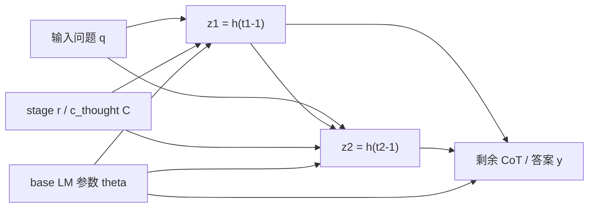
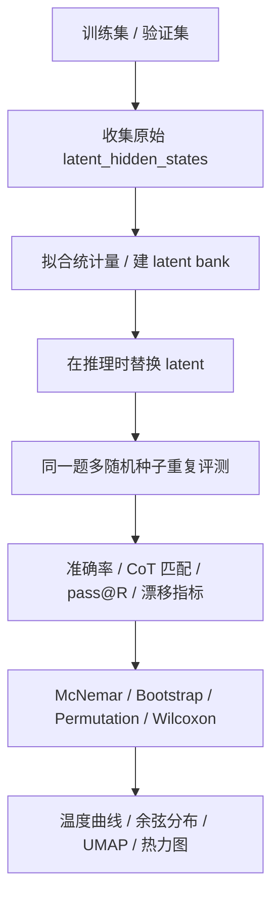

# 1563245379/coconut 中 Latent 的作用与随机替换设计研究

## 执行摘要

这个仓库里的 `Latent`，不是带显式先验分布的“潜变量模型 latent”，而是 `Coconut` 在前向传播里把 `<|latent|>` 占位 token 的输入 embedding，替换成“该位置前一个 token 的最后一层 hidden state”之后得到的连续向量。训练数据并不是让模型直接预测这些 latent 向量，而是把前若干个文本推理步骤删掉，换成若干 latent 占位符，然后只对后续的剩余步骤与最终答案计算 loss；推理时先完成 latent 回写，再继续 greedy 解码文本尾部。Latent 的维度由 backbone 的 hidden size 决定；仓库给出的主要配置都默认使用 `openai-community/gpt2`，因此默认维度是 768。 fileciteturn10file0 fileciteturn11file1 fileciteturn11file0 fileciteturn12file0 fileciteturn13file0 fileciteturn13file1 citeturn9view1

因此，**在该仓库当前的推理实现里，Latent 的条件分布本质上是一个 Dirac delta（退化分布）而不是显式高斯或其他随机分布**：给定输入问题、stage、模型参数和先前 latent 后，latent 完全由确定性的 hidden state 决定；`generate()` 也使用 `argmax`，没有 token sampling。换句话说，如果你要“在推理时将 Latent 替换为随机量”，你实际上是在把一个**确定性中间状态**替换成一个新的随机代理变量 \( \tilde z \sim q_\phi(\cdot) \)。从仓库实现的几何约束看，这个代理变量至少要保留五类特征：与 embedding 相同的维度和 dtype/device、与原 hidden state 相近的范数尺度、stage/latent 位置条件、对输入前缀与前序 latent 的条件依赖，以及与 embedding / `lm_head` 的几何兼容性。论文层面，作者把这种连续 hidden state 反馈称作“continuous thought”，并指出它可能编码多个候选下一步、呈现类似 BFS 的规划行为；但仓库实现本身并没有把这种不确定性显式概率化。 fileciteturn10file0 fileciteturn11file0 citeturn7view0turn9view1

如果目标是做严谨且可落地的“随机替换”研究，我建议先做四组实验：**围绕原 latent 的条件化对角高斯**、**经验 latent bank 重采样**、**低秩条件高斯**，以及一个**范数保持随机方向**负对照。前两种最适合先做敏感性分析，第三种最接近“真正的随机替代器”，第四种用于给出明显下界。另一个非常重要的仓库级结论是：按当前 `run.py` 的 `scheduled_stage` 逻辑静态推导，`gsm_coconut_eval.yaml` 和 `prosqa_coconut_eval.yaml` 看起来都可能在评估时**没有真正打开 latent**，这会直接污染随机替换实验，必须先修正。 fileciteturn11file0 fileciteturn12file1 fileciteturn13file2 fileciteturn14file0

## 检索范围与顺序

已启用连接器只有 urlGitHubhttps://github.com；本次 GitHub 代码审查严格限定在 url1563245379/coconut 仓库https://github.com/1563245379/coconut。在覆盖仓库实现之后，我只补充查阅了原始论文页面和默认 backbone 的官方文档，用来解释 paper-level 动机与默认 hidden size。 citeturn7view0turn9view1

| 检索顺序 | 仓库路径 | 审查目的 |
|---|---|---|
| 首先 | `README.md` | 确认论文、数据格式、训练/评测入口 |
| 然后 | `coconut.py` | 定位 Latent 的真正定义、回写逻辑、推理路径 |
| 然后 | `run.py` | 确认 tokenizer、stage 调度、训练/推理流程、debug hook |
| 然后 | `dataset.py` | 确认 latent token 如何插入样本、loss 如何掩码、与输入/输出的条件关系 |
| 然后 | `args/gsm_coconut.yaml` / `gsm_coconut_eval.yaml` / `gsm_cot.yaml` | GSM8K 的 latent 数、stage 配置与 warm-start 路线 |
| 然后 | `args/prontoqa_coconut.yaml` / `prontoqa_coconut_eval.yaml` | ProntoQA 的 stage 与 eval 配置 |
| 然后 | `args/prosqa_coconut.yaml` / `prosqa_coconut_eval.yaml` | ProsQA 的 stage 与 eval 配置 |
| 最后 | `preprocessing/gsm_icot.bash` / `gsm_icot.py` / `prontoqa.py` | 数据来源、原始构造与切分 |
| 额外检查 | 测试相关路径 | 在本次可直接检索到的源码/配置中未见独立 `tests/` 目录，因此“测试”项按**未指定**处理 |

上述路径构成了这份报告的全部仓库证据基础。`README.md` 给出总览与配置语义，`coconut.py`、`run.py`、`dataset.py` 共同形成 latent 的定义与运行闭环，YAML 决定具体 latent 数和 stage；预处理脚本补足数据来源与切分。 fileciteturn15file0 fileciteturn10file0 fileciteturn11file0 fileciteturn11file1 fileciteturn12file0 fileciteturn12file1 fileciteturn12file2 fileciteturn13file0 fileciteturn13file1 fileciteturn13file2 fileciteturn14file0 fileciteturn16file0 fileciteturn16file1 fileciteturn16file2

## 仓库中的 Latent 机制

仓库把三种新 token 加入 tokenizer：`<|start-latent|>`、`<|end-latent|>` 和 `<|latent|>`。样本构造时，问题 `question` 会先被 tokenization；然后根据当前 stage，在问题后面插入起始标记、若干个 `<|latent|>` 和结束标记；训练样本在这个 latent span 后还会接上“剩余的 CoT 步骤 + 最终答案”，而标签会把问题与 latent span 全部 mask 成 `-100`，只监督后面的文本尾部。也就是说，**latent 在训练里承担的是“压缩并替代前若干个推理步骤”的角色**。 fileciteturn11file1 fileciteturn15file0

在 `coconut.py` 中，真正的 latent 定义发生在 `forward()`：代码首先找到所有 `<|latent|>` 的位置，然后按 pass 逐段前向传播；每遇到一个 latent 位置，它并不把 `<|latent|>` 的离散 embedding 留在输入里，而是取**该位置前一个 token 的最后一层 hidden state**，并把这个 hidden state 直接写回 `inputs_embeds` 的 latent 位置。于是，latent 的数学定义可以写成
\[
z_j = h^{(L)}_{t_j-1}(q, z_{<j}; \theta),
\qquad
e_{t_j} \leftarrow z_j,
\]
其中 \(t_j\) 是第 \(j\) 个 latent 位置，\(h^{(L)}\) 是 base LM 最后一层 hidden state，\(e_{t_j}\) 是该位置输入 embedding。**所以，仓库里的 latent 是连续向量 \(z_j\in \mathbb{R}^d\)，不是一个离散 token id。** fileciteturn10file0

Latent 的维度 \(d\) 没有在仓库中写死，而是由 base causal LM 的 hidden size 决定，因为代码直接把 hidden state 当作 input embedding 重新喂回模型；默认 YAML 使用 `openai-community/gpt2`，而 GPT-2 的 `n_embd`/hidden size 是 768，因此仓库默认设置下 latent 是 768 维。若你换成其他 backbone，例如作者注释里提到也测试过的 Llama3，那么 \(d\) 会随 backbone 一起改变。 fileciteturn10file0 fileciteturn12file0 fileciteturn13file0 fileciteturn13file1 citeturn9view1

Latent 的数量由 `run.py` 的 stage 调度和 `dataset.py` 的样本构造共同决定。按当前代码，若不是 `cot`/`no_cot` 分支，则
\[
\text{scheduled\_stage} = \left\lfloor \frac{\text{epoch}}{\text{epochs\_per\_stage}} \right\rfloor,
\qquad
k = \min(\text{max\_latent\_stage}, \text{scheduled\_stage}) \cdot \text{c\_thought}.
\]
其中 `c_thought` 表示“每一个 reasoning step 使用多少个连续 thought token”。因此 latent span 的长度并不直接等于“跳过的推理步数”，而是“跳过步数 × 每步连续 thought 数”。这也是为什么这个仓库的 latent 更准确地说是“连续 thought slots”，而不是“一步一个 latent”。 fileciteturn11file0 fileciteturn11file1 fileciteturn15file0

从输入/输出条件依赖的角度看，训练时模型看到的是“问题 + latent span + 剩余 CoT + 答案”；因此 latent 需要携带足够的信息，使模型从 latent span 后面能继续生成剩余步骤并最终给出答案。推理时，`generate()` 会先调用一次自定义 `forward()` 以完成 latent 回写，再对文本 token 采取 greedy `argmax` 解码。结果上，**仓库的 Coconut 并不是把整个推理链都 latent 化**；它更像是把前一段推理用连续向量压缩掉，后半段仍在语言空间中展开。这和论文里“continuous thought 代表 reasoning state”的表述是对齐的。 fileciteturn10file0 fileciteturn11file1 fileciteturn11file0 citeturn7view0



上图可以把仓库实现近似看成一个条件图：给定输入问题、stage 与模型参数，第一个 latent \(z_1\) 被确定；后续 latent 则继续条件化于输入和先前 latent；最终输出文本尾部 \(y\) 条件化于所有已回写的 latent。这个图不是论文正式图，而是对当前仓库实现的最贴切抽象。 fileciteturn10file0 fileciteturn11file1

为了便于实验设计，可以把仓库中的 latent 机制压缩成下面这张表：

| 维度 | 仓库中的具体含义 |
|---|---|
| Latent 的“实体” | `<|latent|>` 占位 token 经前向传播后被替换为连续 hidden state |
| 向量维度 | 等于 backbone hidden size；默认 GPT-2 为 768 |
| 个数 | \(k=\min(\text{max\_latent\_stage}, \text{scheduled\_stage})\cdot \text{c\_thought}\) |
| 训练目标 | 不直接监督 latent；只监督 latent span 后的剩余步骤和答案 |
| 推理方式 | 先 latent 回写，再 greedy 解码文本 |
| 作用 | 压缩/替代前一段 CoT reasoning state，作为后续推理的连续前缀 |

表中的每一项，都可以在 `coconut.py`、`dataset.py`、`run.py` 和默认 YAML 中直接对应到实现。 fileciteturn10file0 fileciteturn11file1 fileciteturn11file0 fileciteturn12file0 citeturn9view1

Latent 在推理阶段的功能，可以分成三层理解。第一层是**表示功能**：它承接的是“被删掉的前段 CoT”所携带的 reasoning state；第二层是**计算预算功能**：latent span 用固定数量的连续向量替代若干自然语言 token，从而把一部分推理搬到连续空间，减少显式 thinking tokens；第三层是**规划功能**：从论文动机看，作者希望 continuous thought 能编码多种候选后继状态，而不是像逐 token CoT 那样过早锁定到单一路径。需要强调的是，仓库实现本身只有前两层是代码层面可直接观察到的；第三层更多来自论文结论，而不是仓库里显式实现的采样机制。 fileciteturn11file1 fileciteturn10file0 citeturn7view0

如果严格从“统计特性”回答，你应该把**条件统计**和**经验边际统计**分开。对固定输入 \(q\)、固定 stage、固定模型参数、固定 `eval()` 模式来说，这个仓库里的 latent 是确定性的，因此
\[
p_{\text{repo}}(z_j \mid q, z_{<j}, j, r, \theta) = \delta\!\left(z_j - f_\theta(q, z_{<j}, j, r)\right),
\]
条件均值就是 \(f_\theta(\cdot)\) 本身，条件方差为 0，条件协方差也为 0；但如果你把样本分布扩展到整个数据集上，不同问题、不同 stage、不同 latent 位置上的经验均值、经验方差和经验协方差当然都是非零的，而且**绝不能假设 iid**。第 \(j\) 个 latent 明显依赖前面的 latent 和前缀上下文，因此更合适的写法是 \(z_j=f_\theta(q,z_{<j},j,r)\)，而不是 \(z_j\stackrel{iid}{\sim}p(z)\)。这也是为什么随机替换时，不应该直接用一个“全局 iid 高斯”作为主设计，只能把它当负对照。 fileciteturn10file0 fileciteturn11file0

下面这张表，把“仓库已有统计特性”和“你在实验里应如何估计它们”分开列清楚：

| 统计特性 | 在当前推理实现中的结论 | 适用于随机替换实验的解释 |
|---|---|---|
| 条件均值 | 等于原始确定性 latent \(f_\theta(\cdot)\) | 可作为最自然的随机代理中心 |
| 条件方差 | 0 | 若引入随机量，方差由你设计 |
| 条件协方差 | 0 | 若引入联合采样，需显式建模 |
| 经验均值 | 非零，取决于数据集与位置 | 需要按 stage / latent 位置估计 |
| 经验方差 | 非零 | 用来设定噪声温度与尺度 |
| 经验协方差 | 通常非对角、非独立 | 推荐低秩或 shrinkage 估计 |
| 是否 iid | 否 | 强序列依赖，最好条件化 |
| 是否条件化于输入 | 是 | 至少要条件化于问题前缀与 pass 位置 |

这张表里最重要的一行是“**是否 iid：否**”。如果你的随机变量不携带输入条件，它测到的更像是“latent manifold 的重要性”；如果它条件化于输入前缀与原始 latent，它测到的才更像“原始 latent 精确值的重要性”。 fileciteturn10file0 fileciteturn11file1

最后，需要特别指出一个**仓库配置层面的陷阱**。按 `run.py` 现在的逻辑，`gsm_coconut_eval.yaml` 里的 `resume: 0` 会使 `scheduled_stage=0`，从而令 latent 数变成 0；`prosqa_coconut_eval.yaml` 又把 `cot: True` 与 `coconut: True` 同时打开，在 `internalize_cot=False` 时也会强制 `scheduled_stage=0`。`prontoqa_coconut_eval.yaml` 则相对一致，因为 `resume: 40` 搭配 `epochs_per_stage: 5` 会推导到 stage 8，再被 `max_latent_stage: 6` 截断为 6 个 latent。**这意味着你在开始任何随机替换实验前，必须先修复 eval 配置与 `scheduled_stage` 的耦合。** fileciteturn11file0 fileciteturn12file1 fileciteturn13file2 fileciteturn14file0

## 替换为随机量的设计方案

对这个仓库来说，随机替换不是“随便找个分布采样一个向量塞进去”这么简单。因为 latent 被直接写回 `inputs_embeds`，而且默认 GPT-2 的 input embedding 和 `lm_head` 权重共用几何空间，任何分布错配都会被立即放大到后续 logits 中。所以，真正应当被优先保留的特征，不是抽象的“潜变量多样性”，而是**与 embedding 几何兼容的局部统计**。`run.py` 甚至已经提供了一个分析钩子：把 latent hidden state 直接送进 `lm_head`，解码出 top-k token 和概率，这实际上给了你一个非常廉价的“latent 语义邻域”指标。 fileciteturn11file0 fileciteturn10file0

可以先把“应保留什么”明确成一张表：

| 应保留的特征 | 为什么在这个仓库里重要 |
|---|---|
| 向量维度、dtype、device | latent 直接写进 `inputs_embeds`，形状和类型必须兼容 |
| L2 范数与尺度 | embedding / hidden / `lm_head` 在同一几何空间里，范数错了 logits 会漂移 |
| stage 与 latent 位置 | 不同 stage、不同 pass 的 latent 职责不同 |
| 输入条件 | latent 本来就是输入前缀和前序 latent 的函数 |
| 跨维相关结构 | hidden state 不是独立维度，低秩主方向往往承载语义 |
| 跨 latent 位置相关 | 第 2、3 个 latent 并不独立于第 1 个 latent |
| `lm_head` 语义邻域 | 可通过 top-k token overlap 快速衡量“还像不像原 latent” |

这张表决定了设计优先级：**先保形状和尺度，再保条件均值，再保协方差与 joint dependence。** 如果做不到最后两项，也至少不能破坏第一项。 fileciteturn10file0 fileciteturn11file0 citeturn9view1

下面给出四种候选设计，其中前三种是主方案，第四种是必要的负对照。

### 条件化对角高斯

这是最容易先落地的方案，也最适合做敏感性分析。它把原始确定性 latent \(h_j\) 当成条件均值，围绕它加一个按位置统计量缩放过的高斯扰动：
\[
\tilde z_j = h_j + \tau \, \sigma_{r,j} \odot \epsilon,\qquad \epsilon\sim \mathcal N(0, I).
\]
其中 \(r\) 是 stage，\(j\) 是 latent 位置，\(\sigma_{r,j}\) 来自训练集 latent bank 的经验标准差，\(\tau\) 是噪声温度。这个方案实际上回答的问题是：**“这个 latent 的精确值有多重要；在局部高斯邻域内偏移多少还能保性能？”**

它保留的关键特征很多：维度、dtype、device 不变；条件均值直接对齐到原始 latent；方差按 stage/位置定制；如果你再加一个范数裁剪，就能大体保住 embedding 尺度。它的缺点是仍然依赖原始 deterministic latent，因此更像“局部扰动实验”，不是完全独立的随机替代器；但优点恰恰在于工程稳定、解释清晰、最适合作为第一组实验。期望影响通常是：小温度时准确率下降很小但可观察到少量输出分叉；温度变大后会先破坏 CoT 一致性，再破坏最终答案。这个方案不需要显式学习额外模型，只需要离线收集 latent 统计量。其默认超参建议是：\(\tau\in\{0.05, 0.1, 0.2, 0.4\}\)，范数裁剪比例 `clip_norm_ratio` 取 `1.25`，统计量按 `(scheduled_stage, pass_idx)` 分桶。这个设计与仓库现有逻辑最兼容。 fileciteturn10file0 fileciteturn11file0

```python
# 方案 A：条件化对角高斯
def sample_diag_gaussian(h, std_vec, tau=0.1, clip_norm_ratio=1.25):
    noise = torch.randn_like(h)
    z = h + tau * std_vec * noise

    # 保持尺度不要离原 latent 太远
    h_norm = h.norm(p=2).clamp_min(1e-6)
    z_norm = z.norm(p=2).clamp_min(1e-6)
    max_norm = clip_norm_ratio * h_norm
    if z_norm > max_norm:
        z = z * (max_norm / z_norm)
    return z
```

### 经验 latent bank 重采样

这个方案不再围绕原 latent 做局部扰动，而是直接从经验 latent 流形中抽样。最简单的形式是按 `(stage, latent position)` 建一个 latent bank，从中抽一个向量 \(z^\star\)，然后与原 latent 做凸组合：
\[
\tilde z_j = \beta h_j + (1-\beta) z^\star_{r,j}, \qquad z^\star_{r,j}\sim \mathcal B_{r,j}.
\]
如果你想更强地条件化，也可以不是“随机抽一个 bank 样本”，而是先按 prefix summary 或原 latent 余弦相似度做 kNN，再从近邻里抽样。这个方案真正回答的问题是：**“性能来自‘精确的原始 latent’，还是只要落在一个合适的经验:hidden manifold 上就够？”**

它的最大优点是能保留**非高斯经验分布、真实范数和经验主方向**，而且比低秩模型更少做建模假设。缺点是如果不做条件化，bank sample 可能与当前问题语境完全不匹配，从而造成灾难性漂移；因此我建议不要直接用纯采样，而是至少使用 `mix_beta` 把它和原 latent 混合。一个合理的默认配置是：bank 按 `(scheduled_stage, pass_idx)` 建桶；每桶至少使用数千个 latent；`β ∈ {0.25, 0.5, 0.75}`；若做近邻条件化，则 `K ∈ {16, 32, 64}`。预期上，它比条件化对角高斯更容易降低准确率，但更能揭示 latent manifold 本身的作用。 fileciteturn10file0

```python
# 方案 B：经验 latent bank 重采样
def sample_bank_mix(h, bank_vecs, mix_beta=0.5):
    # bank_vecs: [N, d]
    idx = torch.randint(0, bank_vecs.size(0), (1,), device=bank_vecs.device)
    z_bank = bank_vecs[idx].squeeze(0).to(h.device, h.dtype)
    z = mix_beta * h + (1.0 - mix_beta) * z_bank
    return z
```

### 低秩条件高斯

如果你的目标不是做“扰动实验”，而是真正设计一个**输入条件化的随机替代器**，那么最值得投入的是低秩条件高斯。形式上可以写成
\[
\tilde z_j = \mu_\phi(c_j) + U_{r,j}(\Lambda_{r,j}^{1/2}\xi) + \tau \sigma_{r,j}\odot \epsilon,
\quad \xi\sim \mathcal N(0,I_k),\ \epsilon\sim \mathcal N(0,I_d).
\]
这里 \(c_j\) 可以是“到第 \(j\) 个 latent 之前的 prefix pooled hidden state”、也可以直接是原始 latent 的前一层 summary；\(\mu_\phi\) 用一个很小的线性层或 MLP 预测条件均值；\(U\Lambda U^\top\) 则来自经验协方差的低秩近似。这个方案的核心是：**均值条件化于当前问题上下文，协方差保留 latent 流形的主方向，而不是只加各向独立噪声。**

这是我认为最接近“真正随机 latent 替代器”的方案，因为它不必把原始 latent \(h_j\) 本身当中心，而是可以学一个条件均值 \(\mu_\phi(c_j)\)。进一步，如果你让同一个样本中的所有 latent 位置共享同一个全局因子 \(\xi\)，还能显式建模跨 latent 位置的相关性。不过它的代价也更高：你需要离线收集 latent bank，并拟合条件均值与 PCA/PPCA 统计量。默认建议是：对 GPT-2-small 先用 `rank=32`，更大的 backbone 可试 `rank=64`；均值预测器先用线性层或一层 MLP；\(\tau\) 在 `0.5~1.0` 之间扫；协方差用 shrinkage，避免样本数不足时奇异。预期上，这是最有希望在“引入随机性”和“保持准确率”之间取得最优平衡的方案。 fileciteturn10file0 citeturn7view0

```python
# 方案 C：低秩条件高斯（伪代码）
def sample_lowrank_conditional(cond_vec, mean_head, basis, scales, diag_std, tau=1.0):
    # cond_vec: 条件上下文 c_j
    # mean_head(cond_vec): 预测均值 mu_phi(c_j) -> [d]
    # basis: [d, r], scales: [r], diag_std: [d]
    mu = mean_head(cond_vec)
    xi = torch.randn(basis.size(1), device=cond_vec.device, dtype=cond_vec.dtype)
    eps = torch.randn_like(mu)
    z = mu + basis @ (scales * xi) + tau * diag_std * eps
    return z
```

### 范数保持随机方向

这个方案故意很“笨”，但它必须存在，因为它是最干净的负对照。其形式可以写成
\[
\tilde z_j = \|h_j\|_2 \cdot \frac{\epsilon}{\|\epsilon\|_2},
\qquad \epsilon \sim \mathcal N(0, I).
\]
也就是只保留原始 latent 的范数，不保留方向、条件均值和经验协方差。这个方案通常会严重破坏性能，但它能帮你回答一个非常硬的问题：**“模型到底是在利用 latent 的向量方向与语义几何，还是只是在利用一个‘有合适能量的连续槽位’？”** 如果这个负对照都还能维持不低的精度，那说明 latent 的语义精确性比我们预期的弱；反之，如果一换方向就塌缩，说明方向信息极关键。它不应该被当作主方案，只应作为下界与 sanity check。默认只需要一个温度 `1.0`，不必复杂化。 fileciteturn10file0 fileciteturn11file0

```python
# 方案 D：范数保持随机方向（负对照）
def sample_norm_preserving(h):
    eps = torch.randn_like(h)
    eps = eps / eps.norm(p=2).clamp_min(1e-6)
    z = h.norm(p=2).clamp_min(1e-6) * eps
    return z
```

为了便于横向比较，可以把四种方案压缩成下表：

| 方案 | 数学核心 | 是否条件化 | 保留哪些关键特征 | 优点 | 风险 | 预期影响 |
|---|---|---|---|---|---|---|
| 条件化对角高斯 | \(h + \tau\sigma\odot\epsilon\) | 强，条件在原 latent | 维度、均值、局部尺度 | 最稳定、最好先做 | 仍依赖原 latent | 小到中等精度下降，轻度多样性 |
| latent bank 重采样 | \(\beta h + (1-\beta)z^\star\) | 中，可做 kNN | 经验流形、范数、非高斯性 | 能测试 manifold 作用 | 可能语境错配 | 中等精度下降，更显著多样性 |
| 低秩条件高斯 | \(\mu_\phi(c)+U\xi+\sigma\odot\epsilon\) | 强，条件在上下文 | 条件均值、主方向、部分协方差 | 最像真正随机替代器 | 需要额外拟合 | 在三者中最可能兼顾精度和随机性 |
| 范数保持随机方向 | \(\|h\|\epsilon/\|\epsilon\|\) | 弱 | 范数 | 负对照最干净 | 语义严重丢失 | 通常明显塌缩，但可给下界 |

如果只允许你优先做两组，我建议是：**先做“条件化对角高斯 + 范数保持随机方向”建立上下界，再做“latent bank 重采样”验证 latent manifold 是否重要；最后才投入“低秩条件高斯”。** 这样实验序列最省时间，也最有可解释性。

## 实验评估与可视化

这个仓库已经内置了两类直接可用的主指标：**答案 exact-match 准确率**，以及 **CoT 文本尾部与参考 steps 的 exact match**。`run.py` 会把答案做去逗号和 strip 后比较；也会把输出中 `#` 前面的部分当作 CoT 尾部，与数据里的 `steps` 拼接文本做精确比较。除此之外，`run.py` 还提供了一个非常珍贵的质性分析钩子：当 `debug_latent_k > 0` 且请求 `return_latent_hidden=True` 时，会把每个 latent hidden state 经过 `lm_head` 解成 top-k token 与概率，这恰好可以用来评估替换随机量是否还保留了原 latent 的语义邻域。 fileciteturn11file0 fileciteturn10file0

数据集方面，仓库和预处理脚本能支持三套任务，但“数据是否在仓库中实际随代码提交”与“切分规模是否被显式写明”并不完全一致，所以应该按下表处理：

| 任务 | 仓库中的路径/来源 | 当前状态 | 实验建议 |
|---|---|---|---|
| GSM8K 变体 | `data/gsm_train.json` / `gsm_valid.json` / `gsm_test.json`，由 `preprocessing/gsm_icot.bash` 与 `gsm_icot.py` 从外部文本转换而来 | 原始样本数在已检索源码中**未指定** | 用 `train` 建 latent bank，`valid` 调温度，`test` 报最终结果；若文件不存在则按脚本先生成 |
| ProntoQA | 先生成 `data/5hop_0shot_random.json`，再用 `preprocessing/prontoqa.py` 切成 `9000/200/其余` | 切分逻辑已明确，测试集大小可由 10000 总样本推知为约 800 | 用 `train` 建 bank 和统计量，`valid` 选超参，`test` 报告 |
| ProsQA | `data/prosqa_train.json` / `valid` / `test` | 路径明确，但样本量在已检索源码中**未指定** | 若文件存在，全部按既有 split 使用；若缺文件则标注未指定，不自造新数据 |

这些结论分别来自 `README`、YAML 与预处理脚本。其中，ProntoQA 是唯一在脚本里把切分下标写死了的任务；GSM8K 和 ProsQA 的样本规模在当前可见源码里都没有明示，因此报告中应标成“未指定”。 fileciteturn15file0 fileciteturn16file0 fileciteturn16file1 fileciteturn16file2 fileciteturn12file0 fileciteturn12file1 fileciteturn13file0 fileciteturn13file1 fileciteturn13file2 fileciteturn14file0

我建议评估矩阵不要只做“单次随机采样准确率”，而要分成三层。第一层是**与仓库现有评测完全兼容**的指标：答案准确率、CoT 精确匹配率、平均生成长度、`gen_forward_cnt`、显存与 wall-clock。第二层是**latent 本体漂移指标**：原始 latent 与随机 latent 的余弦相似度、范数比例、top-k token overlap、top-k token 分布 KL 或 Jensen–Shannon 散度。第三层是**随机性收益指标**：同一题重复采样 \(R\) 次时的成功概率 \(\hat p_i\)、`pass@R`、多数投票准确率、输出多样性（唯一答案数、answer entropy）。只有把这三层拆开，你才能区分“随机替换只是把模型搞坏了”和“随机替换有时会帮助探索备选路径”。 fileciteturn11file0 fileciteturn10file0 citeturn7view0

对照组的设置应当至少包括以下几类。基线必须有“原始 deterministic Coconut”；也必须有“零 latent/无 latent”作为结构下界；再加上前面四种随机替换方案。为了避免把“温度高低”和“分布形状”混在一起，每种主方案都要扫一维温度或混合系数，而不是只报一个点。一个合理的最小实验矩阵如下：

| 组别 | 作用 |
|---|---|
| 原始 deterministic Coconut | 主基线 |
| 无 latent / stage=0 | 结构下界 |
| 条件化对角高斯 | 主敏感性实验 |
| latent bank 重采样 | manifold 实验 |
| 低秩条件高斯 | 最强替代器实验 |
| 范数保持随机方向 | 负对照 |

统计显著性方面，答案正确与否是对同一题目的配对二元结果，因此**McNemar 检验**最适合比较原始 deterministic Coconut 与某个随机方案的单次采样准确率差异。对于 `pass@R`、每题成功概率 \(\hat p_i\)、平均余弦相似度等连续指标，更稳妥的是**paired bootstrap 95% CI** 或 **paired permutation test**；若你是按多个随机种子汇总总体均值，也可以对 seed-level 结果用 **Wilcoxon signed-rank**。如果同时比较很多温度点或很多方案，最后用 **Holm–Bonferroni** 做多重比较校正。这样报告结论才不会因为“碰巧某几个随机种子好看”而失真。



上面的流程图就是我建议的完整实验闭环。因为当前仓库已经能返回 latent hidden states、打印 latent decode top-k，并统计答案与 CoT 匹配，所以这条流程事实上和仓库风格是对齐的，只需要补上“latent 收集”和“随机器注入”两块。 fileciteturn11file0 fileciteturn10file0

如果要真正画图，我建议至少画四张。第一张是**温度–准确率曲线**，横轴 \(\tau\)，纵轴答案准确率和 `pass@R`，可以最直观地看鲁棒性；第二张是**latent 漂移直方图/小提琴图**，看余弦相似度和范数比；第三张是**stage × latent position 热力图**，看不同位置对随机替换的敏感度；第四张是**原始 latent 与随机 latent 的 UMAP/PCA 投影**，看随机量是否仍在经验流形附近。这里的 UMAP/PCA 不直接作为结论证据，而是帮助你肉眼判断“方案到底是在局部扰动，还是已经跑出流形”。这些图里，最重要的是第一张和第三张。

## 实现步骤与常见陷阱

真正落地时，我建议按“**先修配置，再建 latent bank，再注入随机器，再跑评测**”的顺序做，而不是一上来改 `coconut.py`。原因很简单：当前 eval YAML 与 `scheduled_stage` 的关系本身就有风险，如果你不先修它，后面收集的 latent bank 和跑出来的随机替换结果都可能是错的。`run.py` 的逻辑说明，评估时 latent 数不是由 checkpoint 名字决定的，而是由 `resume`、`epochs_per_stage`、`cot`/`no_cot` 等开关共同推导出来的。 fileciteturn11file0 fileciteturn12file1 fileciteturn13file2

具体实施可以压缩成下面这张表：

| 步骤 | 改动位置 | 说明 |
|---|---|---|
| 修正 eval stage | `args/*.yaml` | 确保评估时真的有 latent |
| 收集 latent bank | `run.py` 新增收集分支 | 使用 `return_latent_hidden=True` 导出 latent |
| 保存统计量 | 新增 `.pt` 文件 | 按 `(scheduled_stage, pass_idx)` 保存均值、std、PCA 基 |
| 注入随机器 | `coconut.py` | 在 `tensor_list[batch_idx][token_idx] = h` 前替换 `h` |
| 传递 stage | `run.py` -> `forward()` / `generate()` | 让随机器知道当前 stage 与 latent 位置 |
| 记录指标 | `run.py` | 保存答案准确率、CoT 匹配、latent 漂移、种子 |
| 固化随机性 | `utils.py` / 配置文件 | 把 `seed` 与随机器温度一起写入配置和日志 |

在代码层面，最干净的挂载点就是 `coconut.py` 里这句：`tensor_list[batch_idx][token_idx] = h`。因为到这个时刻，代码已经通过 `hidden_states_offset` 处理好了 KV cache 导致的索引偏移，也已经拿到了最终要写回的连续向量 `h`。换句话说，**你要随机化的不是离散 latent token 本身，而是这一步求出的 `h`。** 同时，应尽量不要破坏仓库现有“避免 in-place op”的写法，保持返回一个新的张量后再写入 `tensor_list`。 fileciteturn10file0

下面给出一个最小可复现的随机器代码片段，风格尽量贴近仓库现有 PyTorch 写法。这个片段支持三种核心模式：`diag_gaussian`、`bank_mix` 和 `norm_only`；如果你已经离线拟合好低秩统计量，也可以很容易加进同一个类里。

```python
# latent_randomizer.py
import torch


class LatentRandomizer:
    def __init__(
        self,
        mode="none",
        temp=0.1,
        mix_beta=0.5,
        clip_norm_ratio=1.25,
        stats=None,   # {(stage, pos): {"std": [d], "mean": [d], ...}}
        bank=None,    # {(stage, pos): [N, d]}
    ):
        self.mode = mode
        self.temp = temp
        self.mix_beta = mix_beta
        self.clip_norm_ratio = clip_norm_ratio
        self.stats = stats or {}
        self.bank = bank or {}

    def _key(self, stage, pos):
        return (int(stage), int(pos))

    def _clip_norm(self, z, h):
        h_norm = h.norm(p=2).clamp_min(1e-6)
        z_norm = z.norm(p=2).clamp_min(1e-6)
        max_norm = self.clip_norm_ratio * h_norm
        if z_norm > max_norm:
            z = z * (max_norm / z_norm)
        return z

    def sample(self, h, stage, pos):
        key = self._key(stage, pos)

        if self.mode == "none":
            return h

        if self.mode == "diag_gaussian":
            stat = self.stats[key]
            std = stat["std"].to(h.device, h.dtype)
            z = h + self.temp * std * torch.randn_like(h)
            return self._clip_norm(z, h)

        if self.mode == "bank_mix":
            bank = self.bank[key].to(h.device, h.dtype)  # [N, d]
            idx = torch.randint(0, bank.size(0), (1,), device=h.device)
            z_bank = bank[idx].squeeze(0)
            z = self.mix_beta * h + (1.0 - self.mix_beta) * z_bank
            return self._clip_norm(z, h)

        if self.mode == "norm_only":
            eps = torch.randn_like(h)
            eps = eps / eps.norm(p=2).clamp_min(1e-6)
            z = h.norm(p=2).clamp_min(1e-6) * eps
            return z

        raise ValueError(f"Unknown latent randomizer mode: {self.mode}")
```

然后，在 `coconut.py` 中做一个非常小的改动：给 `Coconut.__init__` 新增一个 `latent_randomizer=None` 参数，并在生成 `h` 后、写回 `tensor_list` 之前调用它。推理时启用，训练时禁用，这样可以保证 checkpoint 与仓库原始训练保持可比。

```python
# coconut.py 中的最小改动示意

class Coconut(nn.Module):
    def __init__(
        self,
        base_causallm,
        latent_token_id,
        start_latent_id,
        end_latent_id,
        eos_token_id,
        latent_randomizer=None,
    ):
        super(Coconut, self).__init__()
        ...
        self.latent_randomizer = latent_randomizer

    def forward(self, input_ids, attention_mask, labels, position_ids, **kwargs):
        ...
        scheduled_stage = kwargs.get("scheduled_stage", 0)
        ...
        for pass_idx in range(max_n_latents):
            ...
            for idx_pair in filling_indices:
                batch_idx, token_idx = idx_pair
                h = hidden_states[batch_idx, token_idx - 1 - hidden_states_offset, :]

                # 只在 eval / 推理时替换
                if (self.latent_randomizer is not None) and (not self.training):
                    h = self.latent_randomizer.sample(
                        h=h,
                        stage=scheduled_stage,
                        pos=pass_idx,
                    )

                tensor_list[batch_idx][token_idx] = h
                ...
```

在 `run.py` 里，还需要把 `scheduled_stage` 显式传入模型调用，并加一个 latent 收集函数。下面这个收集函数直接复用仓库已经存在的 `return_latent_hidden` 机制，因此改动最小。

```python
# run.py 中新增：收集 latent bank 的示意函数
from collections import defaultdict

@torch.no_grad()
def collect_latent_bank(parallel_model, dataloader, rank, scheduled_stage):
    bank = defaultdict(list)
    parallel_model.module.eval()

    for batch in dataloader:
        batch = {
            k: v.to(rank)
            for k, v in batch.items()
            if v is not None and k not in ["idx", "position_ids"]
        }

        outputs, latent_hiddens = parallel_model.module.generate(
            **batch,
            max_new_tokens=1,
            synced_gpus=False,
            return_latent_hidden=True,
            scheduled_stage=scheduled_stage,
        )

        for pos, h in enumerate(latent_hiddens):
            bank[(scheduled_stage, pos)].append(h.float().cpu())

    for key in bank:
        bank[key] = torch.stack(bank[key], dim=0)  # [N, d]
    return bank
```

这个实现路径有几个常见陷阱，必须提前规避。第一，`generate()` 当前只支持 `batch_size == 1`，所以 latent bank 收集阶段最好沿用验证 dataloader 的单样本方式；如果你要从训练集批量收集，需要额外写一个 batched collector。第二，`latent_hidden_states` 现在只收集 batch 中第一个样本的 latent，因此如果你把这段逻辑直接搬到训练 dataloader 的大 batch 上，得到的 latent bank 会偏。第三，`MAX_N_LATENT = 8` 只服务于 FSDP `synced_gpus` 的 dummy forward 对齐，如果以后实验把 latent 数放大到 8 以上，必须同步改这个常量，否则可能引发分布式不同步。第四，经验协方差在 \(d=768\) 时很容易样本数不够，因此低秩模型务必加 shrinkage 或 PCA 截断。第五，latent bank 只能来自 train split，不能从 test split 收集，否则会引入隐式泄漏。 fileciteturn10file0 fileciteturn11file0 fileciteturn11file1

调参方面，我会给出一组非常实际的默认值。若你先做条件化对角高斯：温度从 `0.05 / 0.1 / 0.2 / 0.4` 扫；范数裁剪设 `1.25`；统计量按 `(stage, pass_idx)` 分桶。若做 bank mix：先用 `mix_beta=0.75 / 0.5 / 0.25`，不做 kNN，只做桶内随机抽样；如果结果看起来过度恶化，再上 kNN 条件化。若做低秩条件高斯：对 GPT-2-small 先试 `rank=32`、线性均值头、对角残差噪声；如果样本数明显足够，再把 `rank` 提到 64。若你的目标是解释性而不是提升性能，那么一定要保留 `run.py` 里的 latent top-k decode 输出，因为它能非常直观地告诉你：随机替换到底只是“有点漂”，还是已经把 latent 推到了完全不同的语义区域。 fileciteturn11file0 fileciteturn10file0

## 来源

本报告的 GitHub 代码审查只使用了 url1563245379/coconut 仓库https://github.com/1563245379/coconut；其中核心源码与配置来源如下：

- `README.md`：仓库总览、数据格式、训练/评估入口。 fileciteturn15file0
- `coconut.py`：Latent 的真正定义、hidden state 回写逻辑、`generate()` 推理流程、`MAX_N_LATENT`。 fileciteturn10file0
- `run.py`：stage 调度、tokenizer 特殊 token、训练/评测主循环、latent debug decode。 fileciteturn11file0
- `dataset.py`：latent span 如何插入样本、如何 mask 标签、输入/输出条件依赖。 fileciteturn11file1
- `utils.py`：seed 设定与配置封装。 fileciteturn11file2
- `args/gsm_coconut.yaml`、`gsm_coconut_eval.yaml`、`gsm_cot.yaml`：GSM8K 路线与 latent 数配置。 fileciteturn12file0 fileciteturn12file1 fileciteturn12file2
- `args/prontoqa_coconut.yaml`、`prontoqa_coconut_eval.yaml`：ProntoQA 训练/评估配置。 fileciteturn13file0 fileciteturn14file0
- `args/prosqa_coconut.yaml`、`prosqa_coconut_eval.yaml`：ProsQA 训练/评估配置。 fileciteturn13file1 fileciteturn13file2
- `preprocessing/gsm_icot.bash`、`gsm_icot.py`、`prontoqa.py`：GSM8K 与 ProntoQA 的数据来源和切分。 fileciteturn16file0 fileciteturn16file1 fileciteturn16file2

补充外部来源只用了两类原始/官方材料：

- urlCoconut 原始论文页面https://arxiv.org/abs/2412.06769：用于 paper-level 定义、continuous thought 动机、BFS 式规划解释。 citeturn7view0turn10search4
- urlGPT-2 官方文档https://huggingface.co/docs/transformers/v4.42.0/en/model_doc/gpt2：用于默认 backbone hidden size = 768 的确认。 citeturn9view1